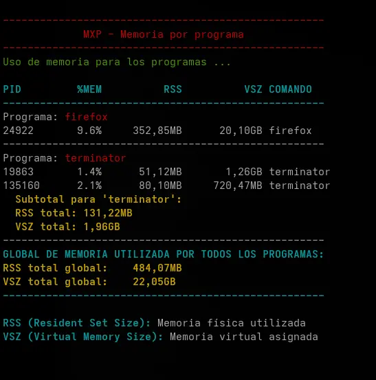

# mxp (Memory per Program - Memory Usage Monitor)
  
## Description

This bash script allows you to monitor the memory usage of one or more running programs. It displays detailed information about physical (RSS) and virtual (VSZ) memory consumption of each process, with results formatted in columns and highlighted with colors for easier reading.

## Features

- Monitors multiple programs in a single execution
- Shows detailed information for each process: PID, %MEM, RSS, VSZ, and command name
- Calculates subtotals for programs with multiple instances
- Calculates the global total when monitoring more than one program
- Formats memory values in human-readable units (KB, MB, GB, etc.)
- Presents results in aligned columns for better visualization
- Uses colors to highlight important information (when run in a terminal)

## Requirements

- Unix/Linux operating system
- Bash shell
- Standard utilities: `ps`, `pgrep`, `numfmt`, `awk`

## Installation

1. Download the script
2. Give it execution permissions:

```bash
chmod +x mxp
```

## Usage

```bash
./mxp <program1> [program2] [program3] ...
```

### Examples

To monitor a single program:
```bash
./mxp firefox
```

To monitor multiple programs at once:
```bash
./mxp firefox chrome spotify
```

## Tools Used

The script uses several standard Unix/Linux tools:

### `ps` (Process Status)

`ps` is a utility that displays information about active processes.

**How it's used in the script:**
- `ps -p $pid -o pid,%mem,rss,vsz,comm --no-headers`: Obtains specific information (PID, memory percentage, RSS, VSZ, and command name) for a specific process without showing headers.
- The `-o` parameter allows you to select exactly which information columns you want to obtain.
- `--no-headers` removes the header line to facilitate processing.

### `pgrep` (Process Grep)

`pgrep` searches for active processes according to a pattern and returns their PIDs.

**How it's used in the script:**
- `pgrep -x "$PROGRAMA"`: Searches for processes whose exact name matches the value of the `$PROGRAMA` variable.
- The `-x` option ensures it matches exactly the full process name, not subsets.
- It's used to verify if a program is running and to obtain the PIDs associated with a specific program.

### `numfmt`

`numfmt` is a utility for converting numbers between different formats, including human-readable size units.

**How it's used in the script:**
- `numfmt --to=iec --suffix=B --format="%.2f" $((rss * 1024))`: Converts a value in KB to a readable format (KiB, MiB, GiB, etc.).
- `--to=iec`: Uses the IEC standard for units (KiB, MiB, GiB).
- `--suffix=B`: Adds "B" (bytes) at the end of each value.
- `--format="%.2f"`: Displays values with two decimal places.
- `$((rss * 1024))`: Converts KB to bytes so numfmt can process it correctly.

### `awk`

`awk` is a programming language designed to process text, especially suitable for manipulating structured data in columns.

**How it's used in the script:**
- To extract specific fields from the `ps` output:
  ```bash
  mem_info=$(ps -p $pid -o pid=,%mem=,rss=,vsz=,comm=)
  pid=$(echo $mem_info | awk '{print $1}')
  ```
- To calculate sums in subtotals:
  ```bash
  total_rss=$(ps -p $(echo $pids | tr ' ' ',') -o rss --no-headers | awk '{sum+=$1} END {print sum}')
  ```
  Here, `awk` sums all values in column `$1` (RSS) and displays the result at the end.

## Script Execution Flow

1. **Argument verification**: Checks if at least one program name has been provided.
2. **Color configuration**: Defines colors for compatible terminals.
3. **Format definition**: Establishes formats to correctly align columns.
4. **Program processing**:
   - For each specified program, it verifies if it's running using `pgrep`.
   - Gets the PIDs associated with the program.
   - For each PID, it obtains and displays detailed memory information using `ps`.
   - If there are multiple instances, it calculates subtotals using `awk`.
5. **Global total calculation**: If several programs have been found, it displays the global total of memory used.

## Output

The script provides the following information:

- **PID**: Process identifier
- **%MEM**: Percentage of physical memory used
- **RSS**: Resident Set Size - Physical memory actually used by the process (in readable format)
- **VSZ**: Virtual Memory Size - Virtual memory allocated to the process (in readable format)
- **COMMAND**: Process name

For programs with multiple instances, a subtotal of RSS and VSZ is displayed. If more than one program is monitored, a global total of memory consumed by all analyzed programs is shown.

## Explanation of Memory Values

- **RSS (Resident Set Size)**: The amount of physical RAM memory that a process is using. This is the most relevant value to determine the real impact of a process on the system.

- **VSZ (Virtual Memory Size)**: The total amount of virtual memory allocated to a process, including shared memory, swapped memory, and memory-mapped files. This value is usually larger than RSS and doesn't necessarily represent the actual use of resources.

## Output Example

```
Memory usage for programs ...

PID      %MEM           RSS           VSZ COMMAND
------------------------------------------------
Program: firefox

3721     3.2%       511.25MiB      1.72GiB firefox
3823     1.8%       287.42MiB    955.67MiB firefox
4022     0.7%       112.18MiB    780.45MiB firefox
  Subtotal for 'firefox':
  Total RSS:     910.85MiB
  Total VSZ:     3.43GiB
------------------------------------------------
Program: chrome

8561     1.5%       245.33MiB      1.15GiB chrome
8602     0.6%        98.75MiB    670.22MiB chrome
  Subtotal for 'chrome':
  Total RSS:     344.08MiB
  Total VSZ:     1.80GiB
------------------------------------------------
TOTAL GLOBAL MEMORY USED BY ALL PROGRAMS:
Global total RSS:     1.23GiB
Global total VSZ:     5.23GiB
----------------------------------------------------------

RSS (Resident Set Size): Physical memory used
VSZ (Virtual Memory Size): Virtual memory allocated
```

## Notes

- If a specified program is not running, the script will notify you.
- Colors are only displayed when the script is run in an interactive terminal.
- For more detailed information about the memory usage of a specific process, consider using tools such as `top`, `htop`, or `smem`.

## Author
A couple of AI chatbots and Daniel Horacio Braga  
README generated in spanish and translated by Anthropic Claude - https://www.anthropic.com/claude

## License

This script is free to use and distribute.
